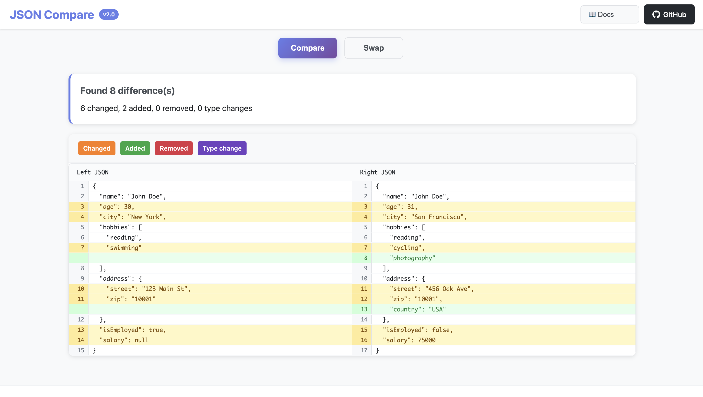

# JSON Compare Documentation

> Comprehensive guide for the JSON Compare tool

## Table of Contents

- [Web Interface Guide](#web-interface-guide)
- [Command Line Interface](#command-line-interface)
- [API Reference](#api-reference)
- [Diff Algorithm](#diff-algorithm)
- [Contributing](#contributing)
- [Troubleshooting](#troubleshooting)

## Web Interface Guide

### Getting Started

The web interface provides an intuitive way to compare JSON files without any installation. Access it at [m-hammad-faisal.github.io/json-compare](https://m-hammad-faisal.github.io/json-compare/).


*The professional web interface with side-by-side JSON comparison*

### Interface Overview

**Input Methods**
- **File Upload**: Click "Choose File" to upload JSON files
- **Direct Input**: Paste or type JSON directly into text areas
- **Drag & Drop**: Drop JSON files onto the input areas

**Comparison Controls**
- **Compare Button**: Initiates the diff analysis
- **Swap Button**: Exchanges left and right inputs
- **Theme Toggle**: Switch between light and dark themes (☀️/🌙)
- **Documentation**: Access this guide and help information

**Diff Visualization**
- **Side-by-Side View**: GitHub-style comparison layout
- **Line Numbers**: Corresponding line references
- **Intelligent Color Coding**: 
  - 🟢 **Green**: Added properties (only in right JSON)
  - 🔴 **Red**: Removed properties (only in left JSON)
  - 🟡 **Yellow**: Changed values (different content)
  - 🟣 **Purple**: Type changes (same property, different data type)
  - ⚪ **Gray**: Unchanged properties

### Theme Support

**Dark/Light Mode Toggle**
- Click the ☀️/🌙 icon in the navigation bar to switch themes
- Your preference is automatically saved and persists across sessions
- Both themes provide optimal contrast for diff visualization
- All UI elements adapt seamlessly to the selected theme

**Theme Features**
- **Light Theme**: Clean, professional appearance with high contrast
- **Dark Theme**: Comfortable viewing in low-light environments  
- **Smooth Transitions**: Animated theme changes for better UX
- **Consistent Colors**: Diff colors maintain readability in both themes

### Type Change Detection

**Advanced Semantic Analysis**
The tool intelligently detects when JSON properties change data types, highlighting these critical structural changes with distinct purple coloring.

**Common Type Change Examples:**
- `"hobbies": ["reading", "swimming"]` → `"hobbies": "swimming"` (Array to String)
- `"age": 30` → `"age": "30"` (Number to String)  
- `"isActive": true` → `"isActive": 1` (Boolean to Number)
- `"config": {"key": "value"}` → `"config": "disabled"` (Object to String)

**Why Type Changes Matter:**
- **API Breaking Changes**: Identify when APIs change response formats
- **Data Migration Issues**: Spot unintended type conversions
- **Configuration Errors**: Detect structural config file changes
- **Code Compatibility**: Ensure data contracts remain consistent

### Best Practices

1. **Format JSON**: Use pretty-printed JSON for better readability
2. **Large Files**: Browser may slow with files >10MB
3. **Privacy**: All processing happens locally - no data uploaded
4. **Mobile Use**: Interface adapts to smaller screens
5. **Theme Choice**: Use dark theme for extended comparison sessions
6. **Type Changes**: Pay special attention to purple-highlighted type changes

## Command Line Interface

### Installation

```bash
# Clone repository
git clone https://github.com/M-Hammad-Faisal/json-compare.git
cd json-compare
npm install

# Optional: Install globally
npm link
```

### Usage

**Basic Comparison**
```bash
node src/json-compare.js file1.json file2.json
```

**Using NPM Scripts**
```bash
# Compare specific files
npm start path/to/file1.json path/to/file2.json

# Run with example files
npm run example
```

**Global Command (after npm link)**
```bash
json-compare file1.json file2.json
```

### Output Format

The CLI provides detailed comparison results:

```
🔍 Comparison Results: 5 difference(s) found

ℹ️ Path: user.age
   Type: Value Changed
   Left:  30
   Right: 31

🟣 Path: user.hobbies
   Type: Type Changed
   Left:  array ["reading", "swimming"]
   Right: string "swimming"

➕ Path: user.address.country
   Type: Added
   Value: "USA"

➖ Path: user.phone
   Type: Removed
   Value: "+1234567890"
```

## API Reference

### JsonCompare Class

```javascript
const comparer = new JsonCompare();
const differences = comparer.compareObjects(leftJson, rightJson);
```

**Methods**

- `compareObjects(left, right)` - Main comparison method
- `compare(left, right, path)` - Recursive comparison with path tracking
- `compareArrays(left, right, path)` - Array-specific comparison
- `formatDifferences()` - Human-readable output formatting

**Difference Types**

| Type | Description | Example | Visual Color |
|------|-------------|---------|-------------|
| `value_change` | Property exists in both, different values | `"John"` → `"Jane"` | 🟡 Yellow |
| `type_change` | Property exists in both, different types | `30` → `"30"` | 🟣 Purple |
| `added` | Property only in right file | `null` → `"new_value"` | 🟢 Green |
| `removed` | Property only in left file | `"old_value"` → `null` | 🔴 Red |

## Diff Algorithm

### LCS Implementation

The web interface uses a **Longest Common Subsequence (LCS)** algorithm for line-by-line comparison:

1. **Line Normalization**: Removes trailing commas and whitespace
2. **JSON-Aware Matching**: Recognizes property names for better alignment
3. **Change Classification**: Determines if lines are added, removed, or modified
4. **Visual Rendering**: Maps changes to color-coded diff display

### Performance Characteristics

- **Time Complexity**: O(m × n) where m, n are line counts
- **Space Complexity**: O(m × n) for the dynamic programming table
- **Optimal for**: JSON files with similar structure
- **Limitations**: Large files (>10,000 lines) may impact browser performance

## Contributing

### Development Setup

```bash
git clone https://github.com/M-Hammad-Faisal/json-compare.git
cd json-compare
npm install
npm run example  # Test the tool
```

### Code Style

- **ES6+ JavaScript**: Modern syntax preferred
- **No External Dependencies**: Keep it lightweight
- **Clear Naming**: Descriptive variable and function names
- **Documentation**: Comment complex algorithms

### Pull Request Process

1. Fork the repository
2. Create a feature branch (`git checkout -b feature/amazing-feature`)
3. Make your changes
4. Test thoroughly
5. Submit a pull request with clear description

## Troubleshooting

### Common Issues

**"Invalid JSON" Error**
- Ensure JSON is properly formatted
- Check for trailing commas, missing quotes
- Use a JSON validator online

**Performance Issues**
- Large files may cause browser slowdown
- Consider breaking large JSON into smaller chunks
- Use CLI for very large files

**Diff Not Showing**
- Verify both inputs have content
- Check browser console for JavaScript errors
- Try refreshing the page

**Theme Not Switching**
- Ensure JavaScript is enabled in your browser
- Check if localStorage is available (required for theme persistence)
- Try clearing browser cache and reload

**Type Changes Not Highlighted**
- Verify both JSONs are properly formatted and valid
- Check that properties exist in both JSONs (type changes require same property names)
- Ensure the data types are actually different (not just different values)
- Try refreshing and re-comparing the JSONs

### Browser Compatibility

| Browser | Version | Support |
|---------|---------|----------|
| Chrome  | 60+     | ✅ Full |
| Firefox | 55+     | ✅ Full |
| Safari  | 12+     | ✅ Full |
| Edge    | 79+     | ✅ Full |

### Getting Help

- **Issues**: [GitHub Issues](https://github.com/M-Hammad-Faisal/json-compare/issues)
- **Documentation**: This guide
- **Examples**: Check the `/examples` directory

## Requirements

- **Web Interface**: Modern browser with JavaScript enabled
- **Command Line**: Node.js 12.0.0 or higher

## License

MIT License - see LICENSE file for details

## Roadmap

- [ ] Add comprehensive test suite
- [ ] Support for ignoring specific paths
- [ ] JSON schema validation
- [ ] Output formats (JSON, XML, HTML)
- [ ] Configuration file support
- [ ] Performance optimizations for large files
- [ ] Color-coded terminal output

---

<div align="center">

Made with ❤️ by **[M-Hammad-Faisal](https://github.com/M-Hammad-Faisal)**

</div>
