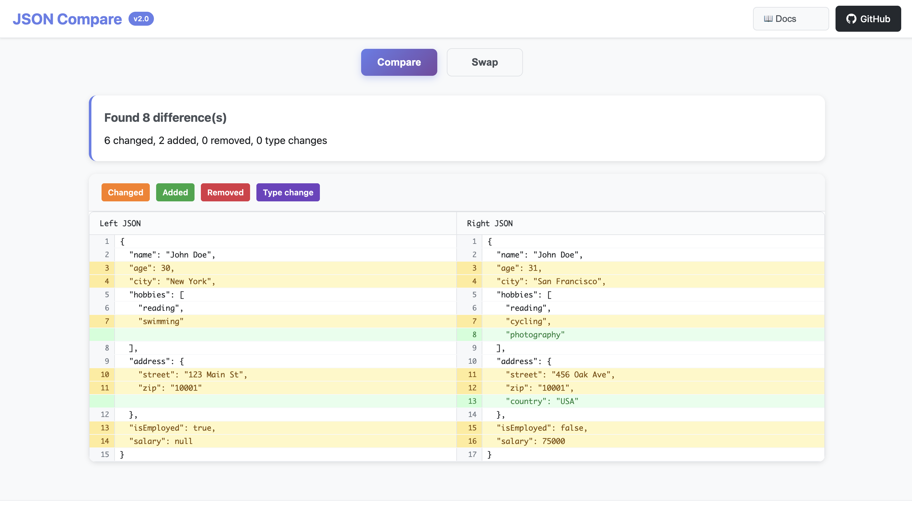

# JSON Compare

> Professional JSON comparison tool with GitHub-style diff visualization

<div align="center">

[](https://m-hammad-faisal.github.io/json-compare/)
[](DOCS.md)

[](https://m-hammad-faisal.github.io/json-compare/)
[](LICENSE)
[](https://github.com/M-Hammad-Faisal/json-compare)

</div>

## Overview

JSON Compare is a powerful, browser-based tool for comparing JSON files with precise diff detection and professional visualization. Built with vanilla JavaScript and featuring GitHub-style side-by-side comparison.

<div align="center">



*Professional side-by-side JSON comparison with GitHub-style diff visualization*

</div>

## Key Features

### Core Functionality
- **GitHub-Style Visualization**: Professional side-by-side diff with syntax highlighting
- **Smart JSON Parsing**: Understands JSON structure for accurate comparisons
- **Multiple Input Methods**: File upload, drag & drop, or direct text input
- **Intelligent Diff Algorithm**: LCS-based comparison with JSON-aware line matching

### User Experience  
- **Instant Comparison**: Real-time diff processing with no server required
- **Dark/Light Theme**: Toggle between themes with persistent preference
- **Mobile Responsive**: Optimized interface for all screen sizes
- **Privacy Focused**: All processing happens locally in your browser
- **Professional UI**: Clean, intuitive interface with helpful documentation

### Technical Excellence
- **Zero Dependencies**: Pure vanilla JavaScript implementation
- **High Performance**: Efficient algorithms handle large JSON files
- **Cross-Platform**: Works in any modern browser
- **Open Source**: MIT licensed with full source code available

## Getting Started

### Web Application

1. **Launch**: Visit [m-hammad-faisal.github.io/json-compare](https://m-hammad-faisal.github.io/json-compare/)
2. **Input**: Upload JSON files or paste content directly
3. **Compare**: Click "Compare" to generate the diff visualization
4. **Analyze**: Review changes with color-coded indicators
5. **Export**: Use browser print/save for documentation

### Command Line Interface

```bash
# Clone repository
git clone https://github.com/M-Hammad-Faisal/json-compare.git
cd json-compare
npm install

# Compare files
npm start examples/left.json examples/right.json
```

## Development

### Local Development Setup

```bash
# Clone and setup
git clone https://github.com/M-Hammad-Faisal/json-compare.git
cd json-compare
npm install

# Run CLI comparison
npm start examples/left.json examples/right.json

# Try example files
npm run example

# Install globally (optional)
npm link
json-compare file1.json file2.json
```

### Architecture

**Web Application**
- Vanilla JavaScript ES6+ (no frameworks)
- CSS Grid/Flexbox responsive design  
- LCS (Longest Common Subsequence) diff algorithm
- JSON-aware parsing and line matching

**Command Line Tool**  
- Pure Node.js implementation
- Zero external dependencies
- Recursive object comparison engine
- Formatted console output

### System Requirements

| Component | Requirement |
|-----------|-------------|
| Web App   | Modern browser with ES6+ support |
| CLI Tool  | Node.js 12.0.0 or higher |
| Memory    | Scales with JSON file size |

## Contributing

Contributions are welcome! Please read our [contributing guidelines](DOCS.md) and submit pull requests for any improvements.

## License

This project is licensed under the MIT License - see the [LICENSE](LICENSE) file for details.

## Roadmap

- **Export Options**: PDF and HTML diff reports
- **Performance**: Large file optimization with chunking
- **Customization**: Ignore patterns and custom rules  
- **Advanced Features**: JSON schema validation and type checking

---

<div align="center">

Made with ❤️ by **[M-Hammad-Faisal](https://github.com/M-Hammad-Faisal)**

⭐ **Star this repo if you find it useful!**

</div>
